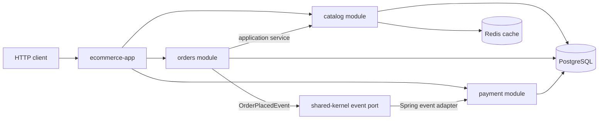

# Modular Monolith E-commerce

[](https://github.com/DanieleMasone/modular-monolith-ecommerce/actions/workflows/ci.yml)
[](https://danielemasone.github.io/modular-monolith-ecommerce/)
[](https://openjdk.org/projects/jdk/21/)
[](https://spring.io/projects/spring-boot)

Portfolio backend project that demonstrates a production-minded modular monolith for an e-commerce domain. The goal is to show clear backend engineering judgment: strong module boundaries, pragmatic CQRS, internal event-driven communication, database migration discipline, automated tests, generated API documentation, and a published GitHub Pages site.

Published documentation: https://danielemasone.github.io/modular-monolith-ecommerce/

## Architecture



The repository is a Maven multi-module Spring Boot application:

```txt
modular-monolith-ecommerce
|-- ecommerce-app      # executable application and runtime configuration
|-- shared-kernel      # small shared abstractions: DomainEvent, EventPublisher, DomainException
|-- catalog            # products, stock ownership, read projections, Redis-backed queries
|-- orders             # order placement, lifecycle, REST API, OrderPlacedEvent publication
`-- payment            # payment attempts and listener for OrderPlacedEvent
```

## What This Demonstrates

- Modular monolith architecture without pretending to be microservices
- Directional module dependencies and enforceable boundaries with ArchUnit
- Catalog-owned stock reservation exposed through an application service
- Orders publishing internal events without knowing payment implementation details
- Payment reacting to `OrderPlacedEvent` after the order transaction commits
- CQRS-light catalog reads using immutable projections and Redis cache
- PostgreSQL schema management through Flyway with Hibernate `ddl-auto=validate`
- Unit, architecture, API, and Testcontainers integration tests
- Generated JavaDoc, generated OpenAPI JSON, and GitHub Pages deployment through one CI workflow
- MapStruct-generated REST boundary mappers with compile-time type checks

## Tech Stack

Java 21, Spring Boot 4.0.6, Spring Web MVC, Spring Data JPA, Hibernate, PostgreSQL, Flyway, Redis, Maven multi-module, Docker Compose, JUnit 5, AssertJ, Mockito, Testcontainers, ArchUnit, MapStruct, springdoc-openapi, Maven JavaDoc, GitHub Actions, GitHub Pages.

## Running Locally

Requirements:

- Java 21
- Maven 3.9+
- Docker with Docker Compose

Start infrastructure:

```bash
docker compose up -d
```

Run the application:

```bash
mvn -pl ecommerce-app spring-boot:run
```

Build and test:

```bash
mvn clean verify
```

Generate JavaDoc:

```bash
mvn -DskipTests package javadoc:aggregate
```

Generate OpenAPI from the running application through Maven:

```bash
docker compose up -d --wait
mvn -pl ecommerce-app -am -Pgenerate-openapi -DskipTests verify
```

The generated specification is written to:

```txt
ecommerce-app/target/generated-docs/openapi.json
```

## API Examples

List products:

```bash
curl http://localhost:8080/api/products
```

Place an order:

```bash
curl -X POST http://localhost:8080/api/orders \
  -H "Content-Type: application/json" \
  -d '{"productId":1,"quantity":2}'
```

Fetch an order:

```bash
curl http://localhost:8080/api/orders/<order-id>
```

Fetch payment result:

```bash
curl http://localhost:8080/api/payments/<order-id>
```

Example error response:

```json
{
  "code": "INSUFFICIENT_STOCK",
  "message": "Insufficient stock for product 1"
}
```

Runtime API documentation:

- Swagger UI: `http://localhost:8080/swagger-ui.html`
- OpenAPI JSON: `http://localhost:8080/v3/api-docs`

OpenAPI metadata, paths, Swagger UI path, and group configuration are defined in:

```txt
ecommerce-app/src/main/resources/openapi.yaml
```

## Design Principles

- Keep the system deployable as one application while preserving module ownership.
- Communicate across modules through application services or internal events.
- Keep domain rules outside REST controllers and infrastructure adapters.
- Use a single PostgreSQL database with Flyway migrations, not fake distributed CQRS.
- Cache read paths where it helps, and evict cache entries on stock changes.
- Prefer explicit tests for architecture rules instead of relying on convention.

## Documentation

Project documentation lives in `docs/`:

- `docs/architecture.md`
- `docs/testing.md`
- `docs/adr/0001-use-modular-monolith.md`
- `docs/adr/0002-use-spring-events-for-internal-communication.md`
- `docs/adr/0003-use-cqrs-light.md`
- `docs/adr/0004-use-flyway-and-postgresql.md`
- `docs/adr/0005-use-generated-openapi-and-mapstruct.md`

The unified CI workflow verifies the project, builds aggregate JavaDoc, exports OpenAPI JSON through the `generate-openapi` Maven profile, combines those outputs with the Markdown documentation, and deploys the resulting static site through GitHub Pages artifact deployment.

Published documentation includes:

- Markdown project documentation at `/docs/`
- Generated JavaDoc at `/javadoc/`
- Generated OpenAPI JSON at `/openapi/openapi.json`

## Future Improvements

- Add idempotency keys for order placement.
- Add a transactional outbox if event delivery needs stronger guarantees.
- Add observability dashboards for module-level metrics.
- Add module-specific package visibility rules if the codebase grows further.
