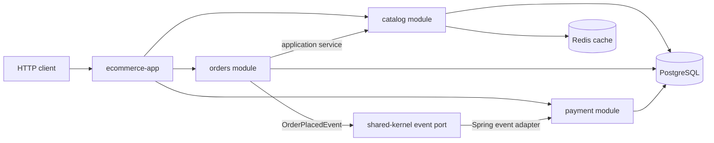

# Modular Monolith E-commerce

[](https://github.com/DanieleMasone/modular-monolith-ecommerce/actions/workflows/ci.yml)
[](LICENSE)
[](https://openjdk.org/projects/jdk/21/)
[](https://spring.io/projects/spring-boot)
[](https://danielemasone.github.io/modular-monolith-ecommerce/)

Portfolio backend project that demonstrates a production-minded modular monolith for an e-commerce domain. The goal is to show clear backend engineering judgment: strong module boundaries, pragmatic CQRS, internal event-driven communication, database migration discipline, automated tests, generated API documentation, and a published GitHub Pages site.

Published documentation: https://danielemasone.github.io/modular-monolith-ecommerce/

## Architecture


```mermaid
flowchart LR
    Client[HTTP client] --> App[ecommerce-app]
    App --> Catalog[catalog module]
    App --> Orders[orders module]
    App --> Payment[payment module]
    Orders -->|application service| Catalog
    Orders -->|OrderPlacedEvent| Shared[shared-kernel event port]
    Shared -->|Spring event adapter| Payment
    Catalog --> PostgreSQL[(PostgreSQL)]
    Orders --> PostgreSQL
    Payment --> PostgreSQL
    Catalog --> Redis[(Redis cache)]
```

The repository is a Maven multi-module Spring Boot application:

```txt
modular-monolith-ecommerce
|-- ecommerce-app      # executable application and runtime configuration
|-- shared-kernel      # small shared abstractions: DomainEvent, EventPublisher, DomainException
|-- catalog            # products, stock ownership, read projections, Redis-backed queries
|-- orders             # order placement, lifecycle, REST API, OrderPlacedEvent publication
|-- payment            # payment attempts and listener for OrderPlacedEvent
`-- coverage-report    # build-only aggregate JaCoCo report module
```

## What This Demonstrates

- Modular monolith architecture without pretending to be microservices
- Directional module dependencies and enforceable boundaries with ArchUnit
- Catalog-owned stock reservation exposed through an application service
- Idempotent order placement for safe HTTP retries
- Orders publishing internal events without knowing payment implementation details
- Payment reacting to `OrderPlacedEvent` after the order transaction commits
- CQRS-light catalog reads using immutable projections and Redis cache
- PostgreSQL schema management through Flyway with Hibernate `ddl-auto=validate`
- Unit, architecture, API, and Testcontainers integration tests
- Generated JavaDoc, generated OpenAPI JSON, JaCoCo coverage, HTML test reports, and GitHub Pages deployment through one CI workflow
- MapStruct-generated REST boundary mappers with compile-time type checks

## Tech Stack

Java 21, Spring Boot 4.x, Spring Web MVC, Spring Data JPA, Hibernate, PostgreSQL, Flyway, Redis, Maven multi-module, Docker Compose, JUnit 5, AssertJ, Testcontainers, ArchUnit, MapStruct, springdoc-openapi, JaCoCo, Maven JavaDoc, GitHub Actions, GitHub Pages. Exact dependency versions are centralized in the root `pom.xml`.

## Quick Start

Requirements: Java 21, Maven 3.9+, and Docker with Docker Compose.

```bash
docker compose up -d
mvn clean verify
mvn -pl ecommerce-app -am spring-boot:run
```

The application starts on `http://localhost:8080`.

Runtime API documentation:

- Swagger UI: `http://localhost:8080/swagger-ui.html`
- OpenAPI JSON: `http://localhost:8080/v3/api-docs`

For detailed setup, report generation, API examples, idempotency behavior, and troubleshooting, read the [User Guide](https://danielemasone.github.io/modular-monolith-ecommerce/docs/user-guide.html).

## Design Principles

- Keep the system deployable as one application while preserving module ownership.
- Communicate across modules through application services or internal events.
- Keep domain rules outside REST controllers and infrastructure adapters.
- Use a single PostgreSQL database with Flyway migrations, not fake distributed CQRS.
- Cache read paths where it helps, and evict cache entries on stock changes.
- Prefer explicit tests for architecture rules instead of relying on convention.

## Documentation

Project documentation lives in `docs/`. The public GitHub Pages root is the static dashboard; generated reports are published beside the source documentation:

| Page | Link |
| --- | --- |
| Dashboard / Documentation site | https://danielemasone.github.io/modular-monolith-ecommerce/ |
| Documentation | https://danielemasone.github.io/modular-monolith-ecommerce/docs/ |
| Review Guide | https://danielemasone.github.io/modular-monolith-ecommerce/docs/review-guide.html |
| User Guide | https://danielemasone.github.io/modular-monolith-ecommerce/docs/user-guide.html |
| API Guide | https://danielemasone.github.io/modular-monolith-ecommerce/docs/api.html |
| Architecture | https://danielemasone.github.io/modular-monolith-ecommerce/docs/architecture.html |
| Business flow | https://danielemasone.github.io/modular-monolith-ecommerce/docs/business-flow.html |
| Trade-offs | https://danielemasone.github.io/modular-monolith-ecommerce/docs/trade-offs.html |
| Testing | https://danielemasone.github.io/modular-monolith-ecommerce/docs/testing.html |
| CI and Pages | https://danielemasone.github.io/modular-monolith-ecommerce/docs/ci-and-pages.html |
| ADR index | https://danielemasone.github.io/modular-monolith-ecommerce/docs/adr/ |
| OpenAPI UI | https://danielemasone.github.io/modular-monolith-ecommerce/openapi/ |
| OpenAPI JSON | https://danielemasone.github.io/modular-monolith-ecommerce/openapi/openapi.json |
| JavaDoc | https://danielemasone.github.io/modular-monolith-ecommerce/javadoc/ |
| Coverage Report | https://danielemasone.github.io/modular-monolith-ecommerce/coverage/ |
| Test Report | https://danielemasone.github.io/modular-monolith-ecommerce/test-report/ |

The `docs/` directory is source documentation and is intentionally committed. The unified CI workflow verifies the project, builds aggregate JavaDoc, exports OpenAPI JSON through the `generate-openapi` Maven profile, combines those generated outputs with the dashboard and Markdown documentation, and deploys the resulting static site through GitHub Pages artifact deployment.

## License

Released under the MIT License. See [LICENSE](LICENSE).

Copyright (c) 2026 Daniele Masone.
