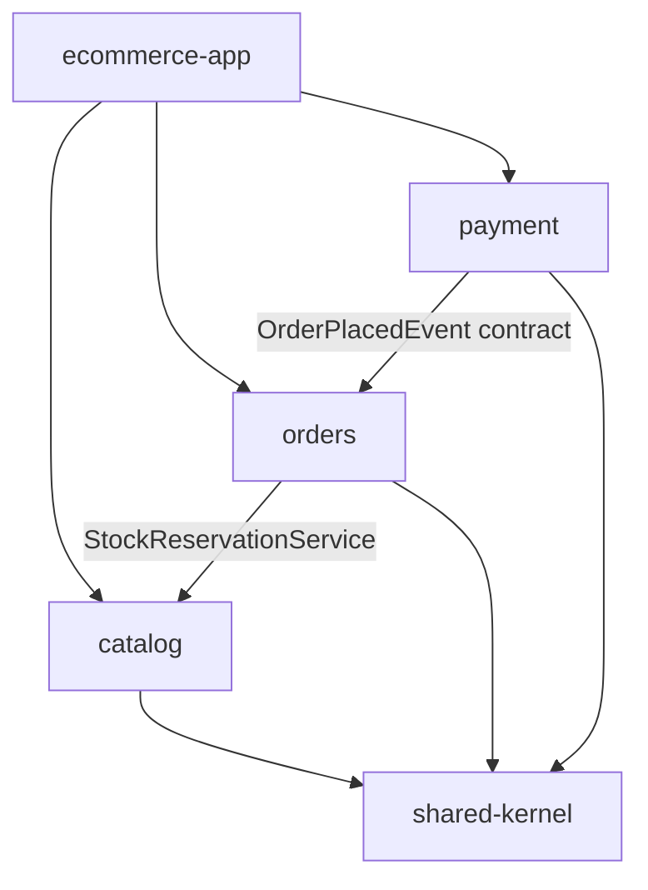
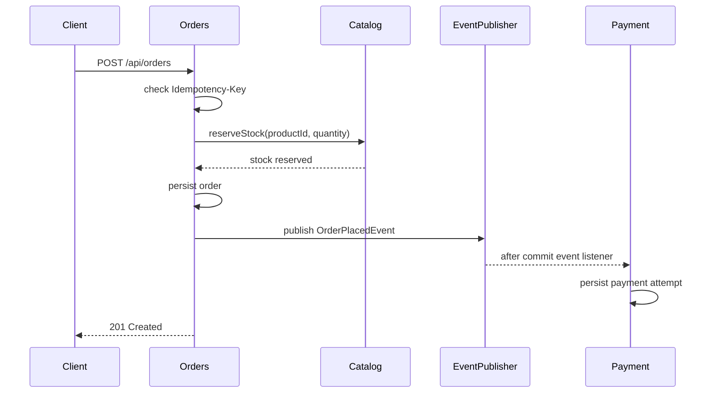

# Architecture

This project is a modular monolith: one deployable Spring Boot application with separately owned business modules. The design keeps operational complexity low while making module boundaries visible and testable.

## Module Responsibilities

`shared-kernel` contains only small shared abstractions:

- `DomainEvent`
- `EventPublisher`
- `DomainException`

`catalog` owns product data and stock:

- product domain model
- JPA entity and repository
- command service for stock reservation
- read projection and query service for list and detail endpoints
- Redis-backed read caching

`orders` owns order placement and order lookup:

- order aggregate
- order repository port and JPA adapter
- REST endpoint for placement and retrieval
- idempotency-key handling for safe client retries
- stock reservation through catalog's application service
- publication of `OrderPlacedEvent`

`payment` owns payment attempts:

- payment model and status
- listener for `OrderPlacedEvent`
- simulated payment authorization
- payment persistence and optional lookup endpoint

`ecommerce-app` composes the runtime:

- Spring Boot entry point
- entity and repository scanning
- Flyway migrations
- REST exception handling
- OpenAPI configuration loaded from `openapi.yaml`
- cache, actuator, datasource, and Docker Compose configuration

## Dependency Direction



Rules enforced with ArchUnit:

- `shared-kernel` does not depend on business modules.
- Domain packages do not depend on REST or infrastructure packages.
- Domain packages do not depend on Spring.
- `orders` does not depend on `payment`.
- Other modules do not reach into catalog persistence.
- Business modules do not depend on the `ecommerce-app` bootstrap module.

## Event Flow



Payment listens after the order transaction commits. That means a failed order cannot trigger payment processing.

If a client retries order placement with the same `Idempotency-Key` and identical product and quantity, orders returns the existing aggregate and skips stock reservation and event publication. If the same key is reused for a different request, orders rejects it with a conflict response.

## CQRS Light

The catalog module separates command and query paths without adding a second database:

- write model: `Product`
- persistence model: `ProductJpaEntity`
- read projection: `ProductView`
- command service: `ProductCommandService`
- query service: `ProductQueryService`

This is intentionally pragmatic. It improves clarity and caching without introducing distributed read models or eventual consistency.

## REST Mapping

REST DTOs are separated from application models. MapStruct generates the boundary mappers during Maven compilation:

- `ProductRestMapper`
- `OrderRestMapper`
- `PaymentRestMapper`

This keeps mapping code explicit and type-checked without hand-written boilerplate.

## API Documentation

springdoc-openapi scans the Spring MVC controllers at runtime and exposes:

- `/v3/api-docs`
- `/swagger-ui.html`

OpenAPI metadata, matched paths, Swagger UI path, and API grouping are configured in `ecommerce-app/src/main/resources/openapi.yaml`.

The unified CI workflow uses the Maven `generate-openapi` profile to export the OpenAPI JSON into `ecommerce-app/target/generated-docs/openapi.json`, then publishes it to GitHub Pages.

The published Pages site exposes both a static Swagger UI at `/openapi/` and the raw specification at `/openapi/openapi.json`.

## Persistence

Flyway owns the PostgreSQL schema. Hibernate runs with:

```yaml
spring:
  jpa:
    hibernate:
      ddl-auto: validate
```

The initial migration creates:

- `catalog_products`
- `customer_orders`
- `payment_attempts`
- seed product rows
