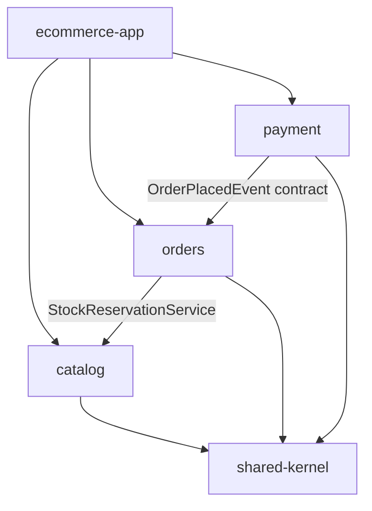
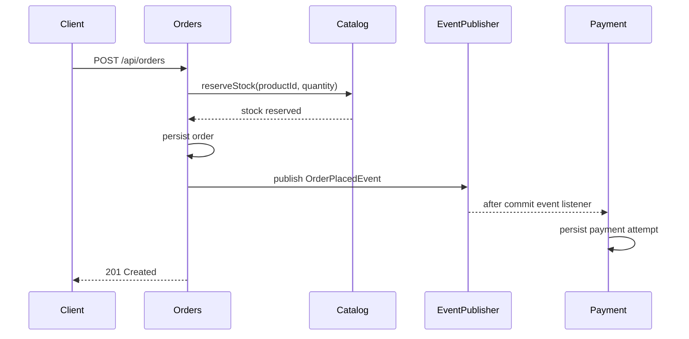

# Architecture

This project is a modular monolith: one deployable Spring Boot application with separately owned business modules. The design keeps operational complexity low while making module boundaries visible and testable.

## Module Responsibilities

`shared-kernel` contains only small shared abstractions:

- `DomainEvent`
- `EventPublisher`
- `DomainException`

`catalog` owns product data and stock:

- product domain model
- JPA entity and repository
- command service for stock reservation
- read projection and query service
- Redis-backed read caching

`orders` owns order placement and order lookup:

- order aggregate
- order repository port and JPA adapter
- REST endpoint for placement and retrieval
- stock reservation through catalog's application service
- publication of `OrderPlacedEvent`

`payment` owns payment attempts:

- payment model and status
- listener for `OrderPlacedEvent`
- simulated payment authorization
- payment persistence and optional lookup endpoint

`ecommerce-app` composes the runtime:

- Spring Boot entry point
- entity and repository scanning
- Flyway migrations
- REST exception handling
- cache, actuator, datasource, and Docker Compose configuration

## Dependency Direction



Rules enforced with ArchUnit:

- `shared-kernel` does not depend on business modules.
- Domain packages do not depend on REST or infrastructure packages.
- Domain packages do not depend on Spring.
- `orders` does not depend on `payment`.
- Other modules do not reach into catalog persistence.

## Event Flow



Payment listens after the order transaction commits. That means a failed order cannot trigger payment processing.

## CQRS Light

The catalog module separates command and query paths without adding a second database:

- write model: `Product`
- persistence model: `ProductJpaEntity`
- read projection: `ProductView`
- command service: `ProductCommandService`
- query service: `ProductQueryService`

This is intentionally pragmatic. It improves clarity and caching without introducing distributed read models or eventual consistency.

## Persistence

Flyway owns the PostgreSQL schema. Hibernate runs with:

```yaml
spring:
  jpa:
    hibernate:
      ddl-auto: validate
```

The initial migration creates:

- `catalog_products`
- `customer_orders`
- `payment_attempts`
- seed product rows
