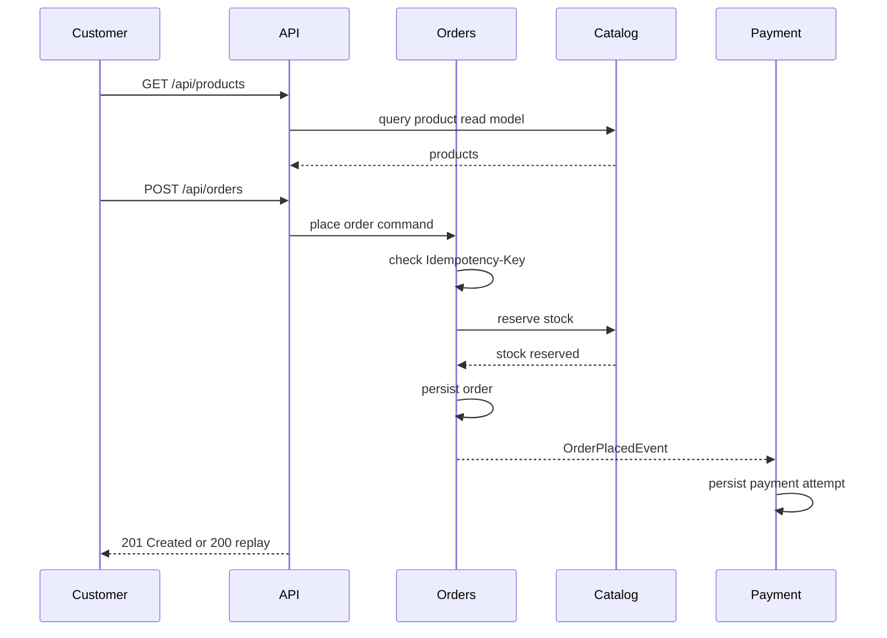

# Business Flow

The application demonstrates a compact e-commerce checkout flow. It is small enough to understand quickly, but it touches the backend concerns reviewers usually care about: validation, module boundaries, stock consistency, events, persistence, caching, and generated API documentation.

## Plain-language Flow

1. A customer browses products.
2. The customer places an order for one product and quantity.
3. The orders module asks catalog to reserve stock.
4. Catalog checks product existence and available quantity.
5. Orders persists the order and publishes `OrderPlacedEvent`.
6. Payment reacts to the event and records a simulated payment authorization.
7. The API can read back the order and payment result.



## API Calls

Browse products:

```bash
curl http://localhost:8080/api/products
```

Place an order with retry protection:

```bash
curl -X POST http://localhost:8080/api/orders \
  -H "Idempotency-Key: checkout-001" \
  -H "Content-Type: application/json" \
  -d '{"productId":1,"quantity":2}'
```

Read the order:

```bash
curl http://localhost:8080/api/orders/<order-id>
```

Read the payment result:

```bash
curl http://localhost:8080/api/payments/<order-id>
```

## Database Side Effects

Successful order placement changes three areas of the database:

| Table | Effect |
| --- | --- |
| `catalog_products` | `available_quantity` decreases for the ordered product. |
| `customer_orders` | a new order row is inserted with status `PLACED` and optional `idempotency_key`. |
| `payment_attempts` | a payment attempt is inserted for the order with status `AUTHORIZED` or `DECLINED`. |

Retrying the same request with the same `Idempotency-Key` does not add rows and does not reduce stock again.

## Technical Notes

Orders talks to catalog through `StockReservationService`, not through catalog repositories. Payment reacts to `OrderPlacedEvent`; orders does not call payment directly and does not know payment implementation details.

That is the main modular monolith idea in this project: one deployable application, clear module ownership, and simple in-process collaboration.
