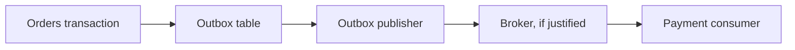

# Architectural Trade-offs

This project is intentionally a modular monolith. The goal is to demonstrate senior backend judgment: choose the simplest architecture that protects important boundaries, and defer operational complexity until there is a reason to pay for it.

## Why Not Microservices

Microservices would add deployment coordination, network failure modes, distributed tracing, contract versioning, and operational ownership questions. This portfolio project has one bounded product/order/payment flow, so the useful engineering signal is not service sprawl. The useful signal is whether the code keeps business boundaries clean inside one deployable application.

The modules are still separated by package, Maven module, application service APIs, persistence adapters, events, and ArchUnit rules. That gives reviewers a clear path to see how the system could split later without pretending it already needs to.

## Why Not Kafka or RabbitMQ

The event flow is local and synchronous enough for the current scope. Adding Kafka or RabbitMQ would create an impression of distributed architecture without real operational requirements such as independent scaling, cross-team ownership, or durable asynchronous integration with external systems.

Spring events are enough here because payment reacts inside the same process after an order is accepted. The design keeps the event contract explicit while avoiding broker configuration, topic management, serialization compatibility, and retry semantics that would be mostly theatrical in this project.

## Why Spring Events Are Enough Here

`OrderPlacedEvent` represents a domain fact owned by orders. Payment listens to that fact and persists a payment attempt. This communicates intent clearly, avoids a direct orders-to-payment dependency, and remains easy to test.

If the system needed guaranteed delivery across process boundaries, the next step would not be to sprinkle a broker into the current design. The next step would be a transactional outbox, explicit event schemas, retry policies, and operational monitoring.

## Why One Database Is Acceptable

A modular monolith can share one PostgreSQL database while still keeping table ownership clear. Catalog owns product and stock rows, orders owns order rows, and payment owns payment attempt rows. Modules do not reach into each other's repositories.

One database gives strong transactional behavior for this small workflow and keeps local development and CI approachable. The boundary discipline is enforced in code and tests rather than hidden behind network calls.

## Why Redis Is Used Only for Read Caching

Redis is used for catalog read caching because product browsing is a natural read-heavy path. It is not used as a source of truth, a distributed lock manager, or a workflow engine.

Stock changes evict catalog read caches, while PostgreSQL remains authoritative for product quantity and order/payment persistence.

## Why CQRS-light Instead of Full CQRS

Catalog separates command behavior from read projections because it clarifies responsibilities and makes caching safe to reason about. It does not introduce a second read database, asynchronous projection rebuilds, or eventual consistency.

Full CQRS would be appropriate only if read and write workloads, data shapes, or ownership models diverged enough to justify that cost.

## Organizational Scaling

If multiple teams owned catalog, orders, and payment independently, the current module boundaries would become team boundaries. The next improvements would be stronger module APIs, published event contracts, ownership docs, and release discipline.

Only after those pressures appear would separate deployables become attractive.

## Next Step Toward Distribution

The credible next step is a transactional outbox for order events. That would preserve database consistency while enabling an external worker or broker to publish events reliably.

That path keeps the current design honest: local events now, durable integration later if requirements justify it.
